# 
《政治经济学》

> **考试题型：**名词解释5个，判断辨析3个，简答5个，材料题1个

## 导论

### 生产力、生产要素和生产关系

**生产方式：**就是社会生活所必需的物质资料的谋得方式，包括生产力和生产关系。

- 生产力——人与自然的关系，是生产的自然属性
  - 劳动力：就是干活的人，是生产过程中的主体
  - 生产资料：是除了人之外的部分
    - 劳动资料——也就是生产所使用的工具
    - 劳动对象——也就是被加工的东西
- 生产关系——人与人之间的关系，是生产的社会属性（广义的生产关系）
  - 生产：生产出满足人类需要的物质产品
  - 分配：分配决定分取这些产品的比例
  - 交换：交换彼此所需要的产品
  - 消费：产品变成人们的使用对象，生产目的得到了实现

### 经济基础和上层建筑

#### 两者的概念

- **经济基础：**是指由社会一定发展阶段的生产力所决定的**生产关系的总和**，是构成一定社会的基础
- **上层建筑：**是建立在经济基础之上的意识形态以及与其相适应的**制度、组织和设施**，在阶级社会主要指政治法律制度和设施

#### 两者的关系

- **经济基础决定上层建筑**，经济基础的性质决定上层建筑的性质，经济基础的变革决定上层建筑的变革
- **上层建筑对经济基础有反作用**，当上层建筑适合新的经济基础而建立起来的时候，他就对新经济基础的巩固和发展起到了积极地促进和服务作用；而当旧的上层建筑为旧的经济基础服务时，他就对新经济基础的形成和发展起到消极的阻碍作用

生产力和生产关系之间的矛盾，以及在这一矛盾基础上产生的经济基础和上层建筑之间的矛盾，是人类社会的基本矛盾。他们存在于一切社会形态中，并贯穿于每一个社会形态的始终。只有联系生产力和上层建筑来研究生产关系，才能科学地、全面地把握生产关系及其发展和变化的规律，真正揭示人类社会发展和变化的规律。

### 生产、分配、交换、消费的关系

#### 生产和分配

- 同一性：分配是生产要素的分配。生产要素的分配总是先于生产，是生产的前提，并决定着生产的结构和产品的分配
- 相互作用：分配是产品的分配
  - 生产决定分配（因为只有生产出东西了才能进行分配；参与生产的方式决定了分配的方式）
  - 分配对生产有着反作用，随着分配的变动，生产也会发生变动

#### 生产和交换

- 同一性：指的是生产要素的交换
  - 在直接生产过程中发生的人的各种活动和各种能力的交换
  - 在直接生产过程中发生的用于制造成品的各种生产资料的交换
  - 在不同生产单位、不同生产部门之间进行的交换
- 相互作用：指的是产品的交换
  - 生产决定交换，如果没有生产，也就没有交换，生产的社会性质决定了交换的社会性质，生产的结构决定了交换的广度和深度
  - 交换对生产有着反作用，当交换的范围扩大的时候，生产的规模也就扩大，生产的分工也就更细

#### 生产和消费

- 同一性：指的是生产要素的消费，包含在直接生产过程中
  - 消费包括劳动者个人能力的消费和生产资料的消费
  - 劳动者个人能力的消费，即个人在生产过程中发展自己的能力
  - 生产资料的消费，即生产资料在生产中被使用和消耗
- 相互作用：指的是产品的消费
  - 生产决定消费
    - 生产为消费创造对象
    - 生产决定消费方式
    - 生产创造出消费的用具和手段
  - 消费对生产具有反作用
    - 消费使生产的产品成为现实的产品，使生产行为和产品得以最终完成
    - 消费也可以创造出新的生产需要，创造出生产的内在动机和目的

> 记忆：是生产和其他三个去发生关系。
>
> - 同一性：指的是生产要素的...
> - 相互作用：指的是产品的...首先，生产决定...然后...决定生产

## 第一章 商品

### 商品二因素(价值&使用价值)

- **价值：凝结在商品中的无差别的一般人类劳动**
  - 在质上是相同的，在量上才能进行比较
  - 把商品的不同使用价值舍去，价值就是无差别的一般人类劳动的凝结
  - 因为不论其使用价值差别有多大，相同的就是他们都耗费了人的体力和脑力
  - 这种无差别的一般人类劳动凝结就是价值
  - 就是因为一切商品都具有共同的东西——价值，才可以相互进行比较，按照一定比例进行交换
- **使用价值：有用性**——一般都是具有使用价值的
  - 商品靠自己的有用性来满足人的某种需要
  - 商品具有使用价值，就是商品能够满足人的某种需要的属性
  - 商品的使用价值是由他的自然属性决定的，商品的自然属性不同，对应的使用价值也不同
  - 同一种商品可以有多种自然属性，从而拥有多种使用价值（衣服可以保暖，可以装饰）
  - 具有使用价值的物品并不都是商品（比如空气），商品必须是劳动产品，并且必须通过交换让渡给他人（商品=劳动产品+交换）
    - 补充：生产出来但是自己用的物品不是商品，因为没有交换
  - 某种物品所具有的使用价值，不会随社会生产关系的变化而变化（奴隶生产和工人生产的小麦的使用价值是一样的）、
- **交换价值**
  - 具有使用价值的物品进入了市场交换，就有了交换价值
  - 商品的使用价值是交换价值的物质承担者
  - 交换价值就是表现为一种使用价值同另一种使用价值相交换的数量关系或比例

**商品是使用价值和价值的统一对立。**

- **统一性：**使用价值是价值的物质承担者，没有使用价值的东西就没有价值，也就不会是商品；有些东西虽然有使用价值，但是不是劳动的产品，所以不具有价值，也不是商品；有些东西虽然是劳动产品，但是没有使用价值，就不是商品；还有一些既是劳动产品又具有使用价值，但是不进行交换的，也不是商品。还有一些具有使用价值的劳动产品，不经过交换，也不是商品。商品必须同时具有使用价值和价值两个因素。
- **对立性：**生产产品不是为了取得使用价值，而是为了取得其价值。为了取得其价值，就必须将商品的使用价值让渡给购买者；同样，对于购买者来说，想要获得商品的使用价值，必须支付商品的价值。这样中间就形成了交换。只有通过交换，才能使商品内在的使用价值和价值的矛盾得到解决。

### 劳动二重性(抽象劳动&具体劳动)

劳动二重性，也就是生产商品的同一劳动的两个方面，一个是具体形态；一个是抽象形态。具体区分为抽象劳动和具体劳动，两者被称为劳动二重性。

概念：

- **具体劳动：**从劳动的具体形态来考察，人们用不同性质和不同形式的劳动生产出不同的商品，这种劳动目的、劳动工具、劳动对象、制作方法、劳动成果各不相同的劳动，就是具体劳动。
- **抽象劳动：**从劳动的抽象形态来考察，**所有的劳动都是人的体力和脑力的支出**，抽掉了各种具体形式的、无差别的、一般意义上的人类劳动，就是抽象劳动。抽象劳动是形成价值的唯一源泉。

> **例子：**对于缝制衣服来说，具体劳动是指，每一个过程都是怎么进行的，比如织布、燃料、缝制，每一个过程都有自己独特的表现形式；从抽象形态来看，归根结底，这个劳动都是归为人的脑力劳动和体力劳动

**商品二因素是由劳动二重性决定的**——WHY?

定义：

- **劳动二重性：**包括具体劳动和抽象劳动
- **商品二因素：**包括价值和使用价值

解释：

- **劳动二重性中的具体劳动创造商品二因素中的使用价值**，因为具体劳动是具体形态上的劳动，使用价值是指的物品的有用性，只有不同的具体劳动才能创造出不同的物品有用性。使用价值是指有用性，有用性就是实实在在能感受到的，必须由具体劳动来创造。
- **劳动二重性中的抽象劳动创造了商品二因素中的价值**，因为价值就是凝结在商品中无差别的一般人类劳动，所以价值实际上产生的根源就是无差别的一般人类劳动，无差别的一般人类劳动就是抽象劳动，所以抽象劳动可以创造价值。

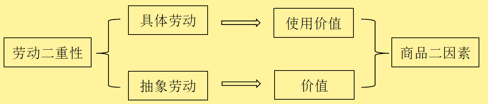

### 商品价值量(劳动力生产率和价值量之间的关系)

**价值量：**凝结在商品中的无差别的一般人类劳动量

- 判断一个商品的价值量为多少，就是看这个商品中凝结了多少一般人类劳动量，我们用社会必要劳动时间来进行衡量。
- 生产一件商品所耗费的社会必要劳动时间越多，表明这件商品中凝结的一般人类劳动量就越多，所以商品的价值量就越大。

**社会必要劳动时间：**在现有的社会正常的生产条件下，在社会平均的劳动熟练程度和劳动强度下制造某种使用价值所需要的劳动时间。

**劳动生产率：**单位时间内所生产的产品数量

> 总结：通过社会必要劳动时间来衡量一般人类劳动量，再来衡量价值量。

**价值量和劳动生产率的关系**

- 价值量分为总价值量和单位价值量
- 当劳动总时长不变的时候，劳动生产率对总价值量没有影响，也就是劳动生产率的变化不会导致总价值量的变化
- 劳动生产率和单位价值量呈负相关，劳动生产率增加，单位价值量下降

> **总结：**价值靠劳动时间来决定，劳动时间不变，总的价值不会变。当劳动生产率提升的时候，单位时间能够生成更多的商品了，说明单位的价值量下降了
>
> ==**单位商品价值量=总价值量/商品数**==

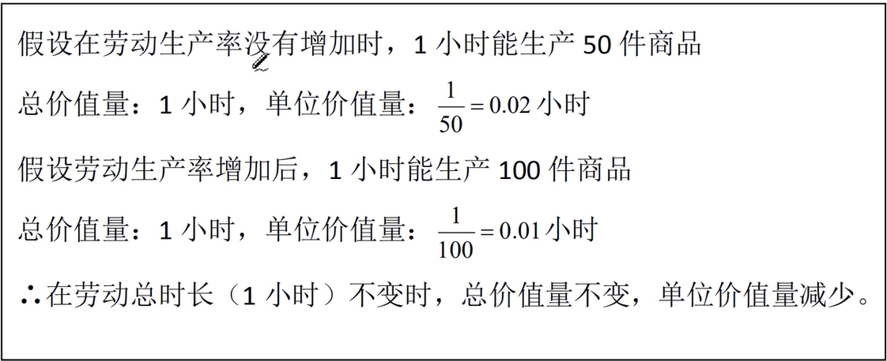

总结：

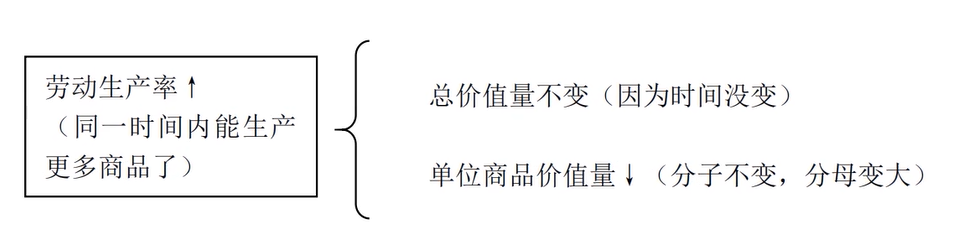

### 简单劳动和复杂劳动

- **简单劳动：**在一定的社会条件下，一般劳动者都能胜任的劳动，无需特别的技术专长、知识和技能训练就能胜任的劳动
- **复杂劳动：**具有一定技术专长的劳动，为了获得这些技术专长和知识，需要经受专门的培养和训练。复杂劳动等于倍加或自乘的简单劳动

## 第二章 货币

### 货币的职能

**货币的定义：固定地充当一般等价物的特殊商品。**在客观上要求了充当一般等价物的商品必须具有通用性和稳定性，于是这种商品就稳定下来成为了货币。——黄金和白银的自然属性最适合充当货币材料，所以选择了黄金和白银。

**货币的演进：**

- **简单的、个别的、偶然的价值形式**——固定的两种物品的交换
- **总和的或扩大的价值形式**——可以和很多东西进行交换
- **一般价值形式**——把某种东西当作了一般等价物，其他东西用一般等价物来进行衡量
- **货币形式**——用金银来充当一般等价物，其他的东西都使用这个固定的一般等价物来进行衡量

**货币的基本职能：**

- **价值尺度：**看到一个物品，就能得知是多少钱，衡量价值
- **流通手段：**充当商品交换媒介的职能，买和卖循环
- **贮藏手段：**货币退出流通领域作为社会财富的一般代表被保存起来的职能，贮藏的货币必须是实在的足值的金银货币（纸币没有贮藏手段）
- **支付手段：**指货币用来清偿债务或者支付赋税、租金、利息、工资等的职能，可以理解为延期支付（先交货后付款）
- **世界货币：**用于国际之间的商品交换

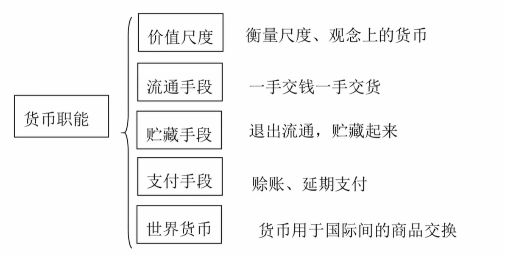

### 货币流通量规律

- 货币流通量决定于商品价格总额和货币流通速度之比。
- 计算公式：==**一定时期内流通中需要的货币量=商品的价格总额/同一单位货币的平均流通速度(次数)**==
- 货币流通量于商品价格总额成正比，和同一单位货币的平均流通速度成反比。

## 第三章 市场经济和价值规律

### 自然经济&商品经济&市场经济

- **自然经济：**自给自足经济，生产直接满足生产者自身需要而不是为了交换的经济形式
- **商品经济：**以交换为目的的经济形式
- **市场经济：**发达的商品经济

### 市场经济的基本特征&机制

**特征：**

- 企业是市场的主体
  - 简单商品经济主要是个体生产者的手工劳动，而市场经济的发展则是建立在社会化大生产的基础之上的，生产不是单个人的生产，而是企业间进行联合生产
- 生产要素的生产配置
  - 社会再生产过程实际上就是生产要素的配置过程，如果没有生产要素在各部门的流动，商品市场的供求也就不能及时达到平衡，市场机制对资源的有效配置就不可能实现
- 法制和信用称为交换关系的基础
  - 商品交换的基本要求是交换者的权利平等
- 经济的开放性
  - 各个国家和地区的联系日益紧密，使市场经济的发展冲破国家之间的界限
- 国家调节的重要性
  - 市场调节具有自发性、盲目性、滞后性等缺点，国家在经济发展中的作用越来越重要

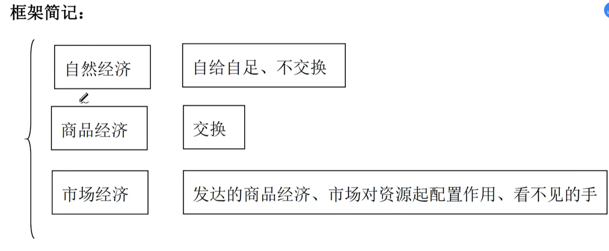

**机制：**

是指在市场经济中通过供求和价格变动、市场竞争、风险约束等途径，来调节经济运行和实现资源配置的作用过程。

- 供求价格体制
  - 市场上的商品的市场价格的变动与市场上该商品供求关系变动之间的有机联系和运动。
  - 供求价值的作用：商品生产者运用它来调整生产方向和生产规模；是商品生产者的竞争手段；可以使消费者改变需求方向、规模和结构；是国家进行宏观调控的重要手段。
- 竞争机制
  - 在市场经济运行中，竞争同供求关系、价格变动和各生产要素流动等市场活动之间的有机联系和作用。所有市场机制都要通过竞争机制起作用，市场促进生产力发展和调节社会资源合理配置的作用，都要通过竞争机制来实现。
  - 竞争机制的作用：可以促使市场经济主体对市场价格信号发出灵敏的反应，从而改善经营管理，提高劳动生产率，根据市场需求调整生产结构；可以导致社会资源在社会各经济部门之间的合理流动，解决市场供需矛盾；是整个市场机制存在和发挥作用的前提条件。
- 风险机制
  - 市场经济参与者的决策是自主的、分散的。要对自己的行为负责，不仅要获得由自身行为所产生的利益，而且要承担由自身行为所产生的风险。

### 价值规律

**价值规律是商品经济的基本规律**

- 商品的价值量由生产商品的社会必要劳动时间决定，不同商品的交换按照等价原则进行
- 价值规律既是价值决定的规律，又是价值实现的规律
- 既调节商品生产，又调节商品的交换

**价格围绕价值上下波动，不违背价值规律。而且正是价值规律作用的表现形式。**

- 商品的价格是价值的货币表现
- 同一种商品的价格经常变动
- 商品价格虽然时升时降，但是商品价格的变动始终以其价值为轴心，价格升降的幅度不会与商品价值相差很远
- 整个社会或者较长时期来看，商品的总价格和商品的总价值是相等的

**价值规律的作用：**

- **微观作用：**激励创新、优胜劣汰（劳动生产率的上升，会使单个商品的价值量下降，从而提升自己的劳动生产率）
- **宏观作用：**分配社会劳动、调节资源配置（资源的互相交换）

## 第四章 资本主义制度及其演变

### 资本原始积累

资本原始积累就是通过**暴力**使直接生产者与生产资料相分离，从而使货币财富迅速集中于少数人手中的历史过程。这个过程发生在资本及与之相适应的生产方式形成前的历史阶段，被称为原始积累。

是资本主义生产方式的前提和起点，对农民土地的剥夺，形成整个原始积累的基础。

资本主义生产方式确立必须具备两个基本条件：

- 出现了大批有人身自由但没有生产资料的劳动者，他们必须靠出卖劳动力为生
- 大量货币财富集中在少数人手里

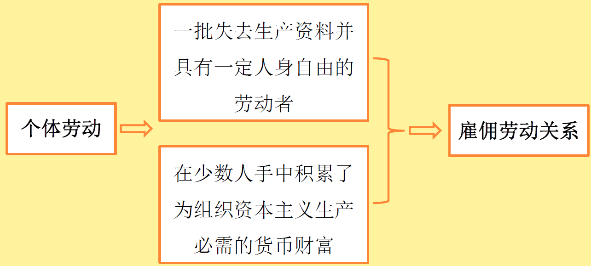

### 垄断与竞争(国家资本&金融资本)

**垄断：**指在生产集中和资本集中高度发展的基础上，少数资本主义大企业为获得高额垄断利润，而对某些部门的生产和市场实施**独占或控制**。垄断的出现既是生产力发展和生产集中化的产物，也是资本主义经济关系发展的必然结果。

**垄断和竞争的关系：**垄断会削弱竞争，但是不会完全消除竞争。

- 垄断没有消除产生竞争的经济条件
- 垄断必须通过竞争来维持
- 社会生产是复杂多样的，任何垄断组织都不可能把包罗万象的社会生产都包下来

**垄断所造成的影响：**剥削加深、限制竞争、抑制创新

- 由于垄断资本获取高额利润，使财富向少数拥有雄厚资本的资本家聚集，劳动群众受到的剥削加重，贫困加深，全社会购买力下降，造成生产的相对过剩，孕育了经济危机
- 虽然垄断不会消灭竞争，但是很大程度上限制了竞争，使相当数量的企业失去了竞争地位而沦为垄断组织的附庸或退出竞争
- 垄断组织依靠自身的垄断地位，左右市场，操控价格，降低了企业的市场反映能力和创新能力，阻碍了生产要素在部门间的流动和再配置，影响了社会经济架构调整的效率
- 抑制了新的技术革新，降低开展新的技术革新的动力

**两个资本：**

- 国家资本：资本与国家政权相结合
- 金融资本：工业和银行业的垄断资本相互渗透，形成了垄断阶段上的最高形态的垄断资本，也就是金融资本

> 国家资本=资本+国家政权
>
> 金融资本=工业垄断资本+银行业垄断资本

## 第五章 资本主义生产

### 资本总公式矛盾及其解决方法

**资本总公式：**

- **货币-商品-货币**（$G-W-G'$，$G'=G+\delta(G)$）
- 意思就是，使用初始货币购买某种商品，然后对初始的商品进行加工，然后最后换回最终的货币。这说明经过加工之后，资本发生了增殖。

**矛盾：**

- **价值增殖与等价交换之间的矛盾。**
- 在买和卖的过程中，商品的交换应该是按照价值等价进行交换，所以按照原理来说，价值量不会发生变化。但是整体来看，价值量确实发生了变化，发生了价值的增殖，这就是资本总公式的矛盾。

**如何解决？**

- 其实在卖之前，已经对商品进行了加工，商品发生了变化，所以价值没有增殖，只是因为通过了一定的加工，使其价值发生了增加（两者的价值差在于一种特殊的商品，也就是中间的加工步骤——劳动力）
- 劳动力是一种可以创造出剩余价值的特殊商品。**劳动力成为商品，是解决资本总公式的矛盾的关键，从而也是货币转换为资本的关键。**

**框架图：**

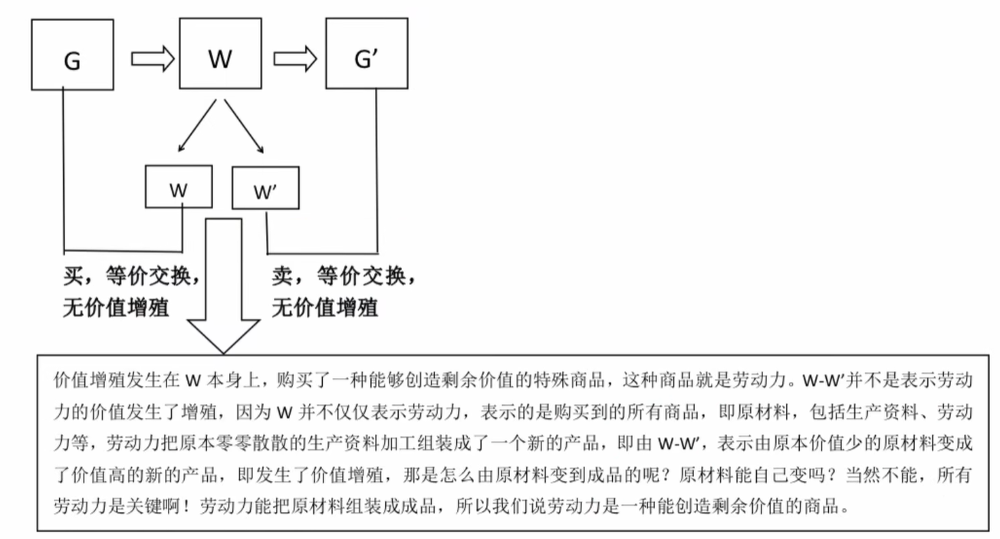

### 剩余价值

**价值增殖：**资本主义生产是以雇佣劳动力为基础的商品生产，其生产过程具有两重性：**一方面是生产使用价值的劳动过程；另一方面是生产剩余价值的价值增殖过程。**

> 通俗来理解就是：资本家雇佣一个劳动力，这个劳动力能给资本家带来两种价值，一种是使用价值，一种是剩余价值，使用价值是工人通过劳动把自己的价值转移到商品之中，注意这时候只是价值转移，并没有价值增殖，这时候工人只是完成由于资本家给他支付工资而必须完成的工作量，但资本家不会让工人的工作就此停止，而是会让工人继续为他劳动，这便是价值增殖过程，工人为资本家额外创造出的大于自身价值的价值，这便是剩余价值。举个例子：假设资本家花 50 块钱雇佣了一个劳动力，这个劳动力最终生产的商品的价值是 90 块钱，那这价值 90 块钱的价值是包含两种价值，其中50块钱是使用价值，也就是和劳动力价值相等的这部分价值，这部分价值是转移到商品之中的，这就是劳动过程，或者叫价值转移过程。剩下的40块钱就是剩余价值，是劳动力为资本家额外创造出来的大于自身价值的剩余价值，也就是价值的增殖。

**剩余价值：**就是由雇佣工人创造的，被资本家无偿占有的超过劳动力价值的价值。（原来那一部分不能算）

**必要劳动时间&剩余劳动时间：**

- **必要劳动时间：**指劳动者的劳动时间中用于生产维持劳动者自身及其家庭生活所必需的生活资料的那部分时间。在必要劳动时间内，生产**必要产品或必要价值**。
- **剩余劳动时间：**劳动者的劳动时间中用于生产维持劳动者自身及其家庭生活所必需的生活资料的时间以外的部分。在剩余的劳动时间内，生产**剩余的产品或剩余价值**。

**绝对剩余价值生产&相对剩余价值生产：**

- **绝对剩余价值生产：**是指在必要劳动时间不变的条件下，通过绝对延长工作日的方法所生产的剩余价值。以这种方法获取剩余价值就是 “绝对剩余价值生产”。在资本主义制度下，工人的工作日包括必要劳动时间和剩余劳动时间两部分，工作日是必要劳动时间和剩余劳动时间的总和。在必要劳动时间不变的情况下，延长工作日的长度就会增加剩余劳动时间，从而增加剩余价值的生产。（例子：把八小时工作制改为12小时工作制）
- **相对剩余价值生产：**是指在工作日长度不变的条件下，通过缩短必要劳动时间、相应延长剩余劳动时间而生产的剩余价值。以这种方法获取剩余价值就是 “相对剩余价值生产”。（例子：还是工作八小时，但是给你布置更多的任务）

### 不变资本和可变资本

- **不变资本：**是转变为生产资料的那部分资本。价值在生产过程中没有发生量的变化，只是改变了它的物质形态。只能发生价值的转移，不能发生价值的增殖。
- **可变资本：**是转变为劳动力的那部分资本。在生产过程中不是转移到新产品上去，而是被工人用于购买生活资料而消费掉了，并且生产出生产出剩余价值。在生产过程中价值量发生了变化，实现了增殖。

> 非劳动力那部分就是不变资本，劳动力那部分就是可变资本。按照是否能创造剩余价值来进行区分。

### 资本主义工资的本质

> 劳动为什么不能成为商品？
>
> 劳动力才能成为商品。

**资本主义的本质：劳动力**的价值或价格

- **劳动力：**是指人的劳动能力，是人的体力和脑力的总和，也就是人用自己的脑力或者体力从事某项工作的能力，即创造价值的能力，能力这个东西是无穷的，一个人的能力有无限的潜力，所以说劳动力，也就是人的劳动能力是无穷无尽的，剩余价值就是由劳动力所创造。
- **劳动：**指劳动能力的支出和耗费，也就是对劳动力的使用和利用。劳动就是干活，就是你实实在在做了什么，在你开始干活的那一刻才存在，停止干活的那一刻就结束了，劳动没有无穷的潜力，自然创造不出来剩余价值。

> 写小说为例子，劳动就是用纸和笔写小说；劳动力是写小说时的创作能力。

**劳动为什么不能成为商品？**

- 任何一种可供出卖的商品，他必须在出卖之前就存在。但是劳动只有在开始的那一刻才存在，劳动力却是一直都存在的
- 商品的价值是人类劳动的凝结，商品的价值量是由生产商品所耗费的社会必要劳动时间决定的。
- 如果说工人出卖的是劳动，那么就会出现这样的问题，资本家获得不到劳动者创造的剩余价值了，就不存在资本主义生产方式

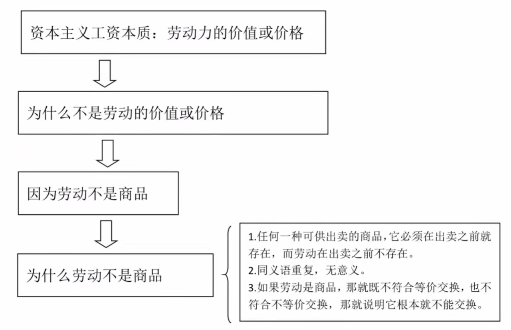

## 第六章 资本循环和周转

### 资本循环的三个阶段&三种形式

**资本循环：**指的是产业资本循环，不能是只进行一次资本增殖，要重复循环进行多次。（将三个步骤循环多次）

- 资本分为产业资本（参与生产过程）、商业资本（不参与生产过程）和借贷资本（利息）。
- 产业资本在其循环运动过程中，依次经过三个阶段（购买、生产和销售），与这三个阶段相联系，依次采取三种职能形式。

**三个阶段：**

- **购买阶段：**货币-商品——劳动力+生产资料，属于货币资本
- **生产阶段：**货币去购买劳动力和原材料，通过生产过程，生产出了商品，属于生产资本
- **销售阶段：**将加工完的东西放到市场上卖，属于商品资本

产业资本实现连续不断地循环，需要具备两个条件——**空间上并存，时间上继起**。

- 资本家的全部资本不能同时存在于循环的某一个阶段上和处于某一种资本形态上，必须把全部的资本按照一定比例分为三个部分，分别处在货币资本、生产资本和商品资本形态上，使三种职能资本形式在空间上同时并存，只有这样，才不会发生生产过程和流通过程的中断
- 产业资本家的三部分资本，其中每一种职能资本形式，都必须连续不断地进行循环，顺次通过三个阶段，依次改变他们的形式，经过循环回到原来的形式上，使三种职能资本形式在时间上相继进行转化

**资本周转：**周而复始不断进行的资本循环，就是资本周转。

### 影响资本周转的因素

- 资本周转时间的长短，包括生产时间和流通时间的长短。资本周转时间越短，资本周转速度就越快
- 生产资本的构成，固定资本和流动资本的比例，流动资本比例越大，资本的周转速度就越快

### 固定资本&流动资本

- **固定资本：**产业资本家用于机器、设备、工具、厂房等劳动资料的那部分生产资本，往往要在多次生产过程中**反复发挥作用**，这部分资本的价值在生产过程中会一部分一部分地被转移到商品中去，并随着商品销售一部分一部分地周转回来。
- **流动资本：**产业资本家用于原材料、燃料、辅助材料等和用于劳动力的那部分生产资本，他们的使用价值在生产过程中被**全部消费掉**，从而他们的价值也被转移到产品中去，随着产品的销售，他们的价值也全被周转回来。

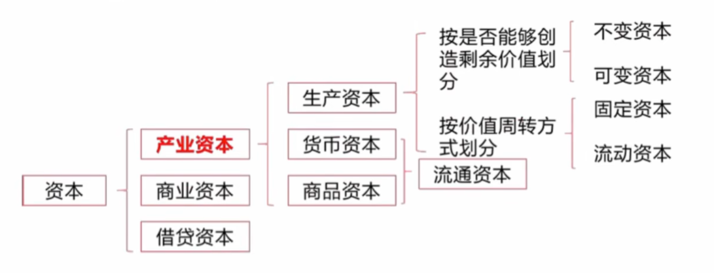

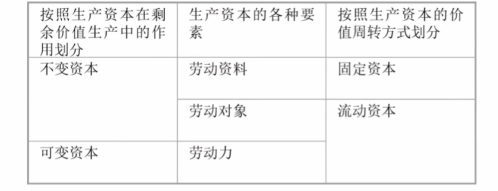

## 第七章 剩余价值的分配

### 生产成本

资本家为了生产预先垫付的资本

**生产成本=不变成本（购买各种生产资料、机器设备等除了劳动力之外的东西所花的钱）+可变资本（购买劳动力所花的钱）**

资本主义制度下，商品的价值由三部分组成：不变资本的价值$c$、可变资本的价值$v$和剩余价值$m$
$$
W=c+v+m
$$

- $c$：购买机器、产房、设备、生产资料等劳动力之外的东西所花的钱，转移到商品之中的，不会发生价值增殖
- $v$：购买劳动力所花的钱，也是没有增殖
- $m$：劳动力创造出来的剩余价值，就是$v$创造出来的，和$c$没有关系，这个才增殖了

**商品的价值分为两部分：**垫付资本（$c+v$）和剩余价值（$m$）

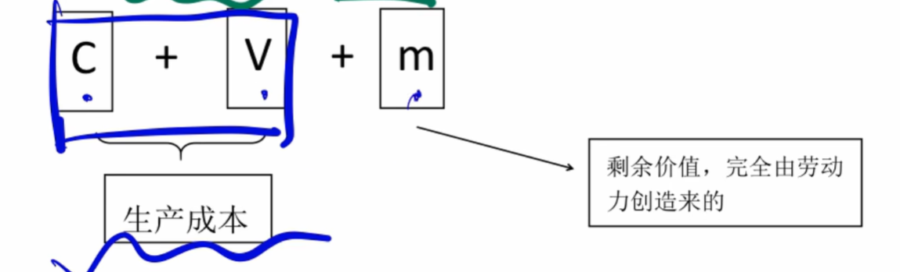

### 剩余价值转化为利润

**剩余价值的来源：**剩余价值并不是由生产中所耗费的全部资本带来的，而是由可变资本带来的。（$c$不能创造，$v$可以创造，只有劳动力才能创造剩余价值）

**剩余价值转化为利润：**生产成本把不变资本和可变资本看成了一个整体，也就是$k=c+v$，剩余价值的源泉是可变资本。当不变资本和可变资本被归结为生产成本时，他们之间的区别就消失了，剩余价值就被看作是商品价值在生产成本以上的增加额，也就是资本家所费资本的产物。

> 总结：利润和剩余价值在数值上是一样的，但是利润是由全部的成本所创造的；剩余价值是由可变资本来创造的，两者有一个不变资本的差距。
>
> 所以，利润掩盖了不变资本和可变资本的根本区别。

**剩余价值和利润的联系和区别：**

- **联系：**利润本质上就是剩余价值，在数量上相同
- **区别：**剩余价值是利润的本质，利润是剩余价值的表现形式；剩余价值是可变资本的产物，而利润表现为全部预付资本的产物。因此，剩余价值转化为利润，就掩盖了资本主义的剥削关系

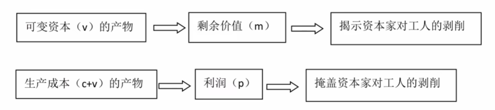

### 利润转化为平均利润

> **因为竞争！**每一个行业都会出现一个平均的利润，大家的利润一定是差不多的

- **不同生产部门利润的差别：**资本有机构成的高低和资本周转速度的快慢，是影响利润率高低的重要因素。在资本有机构成较高或者资本周转速度较慢的生产部门中投资的资本家，在一定时间内获得的剩余价值较少，利润较低；在资本有机构成较低或者资本周转速度较快的生产部门中投资的资本家，获得的剩余价值就较多，利润率就较高。
- **部门之间的竞争形成平均利润：**竞争的手段是资本在不同生产部门之间的转移。资本家都倾向于将资本转入利润率较高的部门。通过部门之间的竞争，资本向利润率高的部门转移，导致资本在各生产部门之间分配的比例发生变化。这样就会使资本在不同生产部门之间进行转移，使各个生产部门的利润率大体趋于平衡，所有的生产部门都获得大体上相等的利润率，就形成了平均利润。一开始利润率低的部门没人做了，利润率就反而会升高了。这样最后就会趋于一个平衡的状态。只有形成平均利润率的时候，资本的转移才会趋于停止。

### 价值转化为生产价格

$$
价值=c+v+m=不变资本+可变资本+利润
$$

$$
生产价格=生产成本+平均利润
$$

随着价值转化为生产价格，市场价格围绕着生产价格上下波动，生产价格成了市场价格波动的中心。生产价格和价值的背离，以及商品按照生产价格而不是按照价值出卖，并没有否定价值规律。

- 从各个生产部门来看，资本家获得的平均利润可以高于或者低于本部门工人创造出来的剩余价值，但从全社会看，整个资产阶级获得的平均利润总额仍然等于整个无产阶级所创造的剩余价值总额。
- 由于全社会平均利润总额等于剩余价值总额，商品的价值总额也必然和生产价格总额相等。从整个社会来看，商品按照生产价格出卖，实际上仍然按照价值出卖。
- 生产价格的变动，归根结底取决于价值的变动。

### 级差地租与绝对地租

#### 级差地租

**概念：**因为等级的差别而产生的地租，租种面积相同的土地，因为肥沃程度、地理位置不同，因而地租数量不同。这是由于农产品个别生产价格低于社会生产价格的差额而形成的超额利润所构成的。

> 农产品个人生产价格低于社会平均生产价格——仍然按照社会平均生产价格来卖——农业资本家获得了超额的利润——农业资本家把获得的利润的一部分分给地主，就形成了地租。
>
> 耕种劣等地的时候，不能获得超额利润。因为劣等地的利润就是正常的利润，是市场上的利润，是最少的利润。其他的超额的利润就是因为地变好了，所以卖的贵了。

**级差地租的源泉：**就是耕种优等地和中等地的农业雇佣工人创造的超额的剩余价值。

**级差地租的形态：**由于形成的条件不同，分为级差地租第一形态和级差地租第二形态。

- **第一形态：**由于土地肥沃程度不同和地理位置的优劣而产生的级差地租。（成本为1000元，收获了100个农产品，说明每一个值10元；收获1000个农产品，说明每一个值1元。但是在市场上卖的都是一个价，所以优等地中出来的农产品赚的多）
- **第二形态：**由于在同一块土地上连续增加投资的劳动生产率不同而产生的级差地租。（提高生产率，在劣等地上种出更多的东西，多投资）

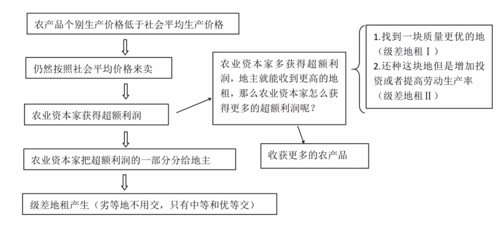

#### 绝对地租

**由于土地私有制的存在，因而租种任何土地都必须缴纳的地租，叫做绝对地租。**——就是不管是什么地，都要交租

#### 两者差别

- 级差地租：由于等级不同——优等地和中等地交租
- 绝对地租：由于土地私有权——所有人都要交租

## 第八章 资本主义再生产和经济危机

### 资本主义的简单再生产和扩大再生产(内涵&外延)

#### 简单再生产&扩大再生产

- 在简单再生产的情况下，工人所创造的全部剩余价值都被资本家用于个人消费，再生产只是在**原有规模上重复进行**。
- 如果资本家不把全部的剩余价值用于个人消费，而是将其中一部分合并到原有的资本中去，用以**购买生产资料和劳动力**，使生产在扩大的规模上进行，这就是资本主义的扩大再生产。

把剩余价值转化为资本，或者说剩余价值的资本化，就叫做**资本积累**。扩大再生产是从物质形态上看的，资本积累是从价值形态上看的，他们是同一事物的两个方面。

#### 外延扩大再生产&内涵扩大再生产

- **外延扩大再生产：**依靠增添新的工厂企业或扩建原有的工厂企业，也就是单纯依靠增加机器设备、劳动力和生产场所来扩大生产规模
- **内涵扩大再生产：**就是依靠技术进步、改进机器设备、提高劳动者的技术水平和劳动效率来扩大生产规模

#### 资本积累&资本积聚&资本集中

- **资本积累：**把剩余价值转化为资本，或者说剩余价值的资本化（继续创造价值）
- **资本积聚：**个别资本依靠自身价值的资本化来增大资本总额。因此，资本积聚不外乎是资本积累的直接结果，他和资本积累直接联系，资本积累的规模越大，资本就积聚的越多，从而个别资本的规模就越大。（每一个资本怎么怎么样）
- **资本集中：**指几个资本结合成为一个较大的资本而引起的个别资本规模的增大，也即许多分散的小资本通过相互合并或者联合形成少数大的资本。（合并之后的资本集合）

### 资本技术构成&资本价值构成&资本有机构成

#### 资本技术构成

资本是由生产资料和劳动力构成的，两者之间存在一定的比例，一般来说，是由生产的技术水平所决定的，**技术水平越高，就说明每个劳动力运用的生产资料就越多。**（技术高，一个人就可以控制更多的生产资料）

所以，资本技术构成就是反映生产技术水平的生产资料和劳动力的比例，公式表示为：
$$
资本技术构成=\frac{C}{V}=\frac{机器设备}{劳动力}
$$

#### 资本价值构成

- 从价值形态上来看，资本是由不变资本和可变资本构成的
- 之间的比例就叫作资本价值构成，公式表达是$\frac{C}{V}$
- 价值构成就是**价格上的比例**——也就是不变资本和可变资本的比例

#### 资本有机构成

- 由资本技术构成决定并反映资本技术构成变化的资本价值构成，叫做资本有机构成。
- 其实资本有机构成就是资本价值构成，只不过有一个定语。
- 资本价值的构成$\frac{C}{V}$可以由很多东西来决定，我们的资本有机构成中，这个比例必须由**技术构成**来决定，不能由其他的成本、人口、天气等其他因素来决定。

### 资本积累的社会经济后果

- **相对人口过剩和失业**
  - 随着资本积累的发展和资本有机构成的提高，社会总资本中不变的部分和可变部分的比例会发生变化，可变的资本部分相对减少，不变的不跟相对会增加（可变的就是劳动力，不变的就是机器设备）
  - 从表面看，总资本的可变部分相对减少，好像是由于工人人口的绝对增长超过了可变资本的增长，但是实际上，人口的过剩是由资本增殖的需要决定的，这种人口过剩既不是绝对的，也不是自然的，而是由资本主义制度造成的相对于资本增殖需要而言的人口过剩。（因为资本有机构成提高了，所以每个人能控制的机器设备就变多了，相当于不需要那么多人来进行生产了，就造成了相对人口过剩）
- **平均利润率下降趋势**
  - 资本有机构成提高了，同一个剩余价值必然表现为不断下降的利润率（也就是说，机器设备与劳动力的比值越来越大，当劳动力不变的时候，提升设备的数量，相当于降低我们的利润率）

### 社会资本简单再生产的过程和实现条件

#### 单个资本和社会总产品

- 在资本主义社会，每个企业的资本都独立地进行循环和周转，实现着价值的增殖，这种独立发挥职能的资本就是**单个资本或者个别资本**
- 每一个企业既要从其他企业购买生产资料，又要向其他企业销售自己的产品。这种互相联系的单个资本的总和，就是**社会资本**
- 各个单个资本的循环和周转，就是彼此交错、互为条件的。这种互相交错的单个资本运动的总和，就是**社会资本的运动**
- **社会总产品**就是指社会各个物质生产部门在一定时期内所生产出的全部物质产品的总和

#### 价值补偿与实物补偿

- **价值补偿：**社会总产品各个组成部分的价值通过商品的出售以货币形式回流，用于补偿在生产中预付的不变资本和可变资本，并取得剩余价值
- **实物补偿：**就是社会总产品的各个组成部分转化为货币之后，必须进一步转化为所需要的物质产品，相当于不变资本价值的部分以及资本家用于个人消费的剩余价值部分，重新取得所需要的生活资料

> 两者的区别就是，**价值补偿就是资本家挣到钱之后把钱花在哪里了，实物补偿就是各部分拿到补偿的钱去买了哪些实实在在的东西**

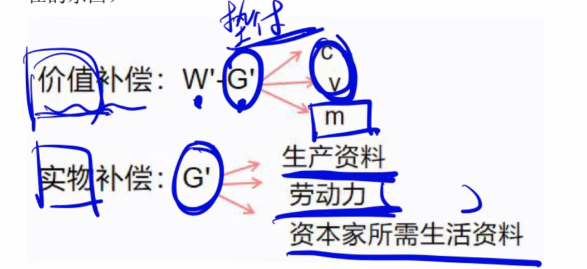

#### 社会资本简单再生产的过程

将社会总产品分为生产资料和生活资料两个大类

- **生产资料：**补偿生产中以及消耗掉的生产资料以及用于扩大再生产的追加生产资料
- **生活资料：**用于满足资本家和工人的个人生活需要

负责生产生产资料的部门和企业为第一部类——生产原材料，机器，设备

负责生产消费资料的所有部门和企业构成了第二部类——生产牛奶，面包，衣服

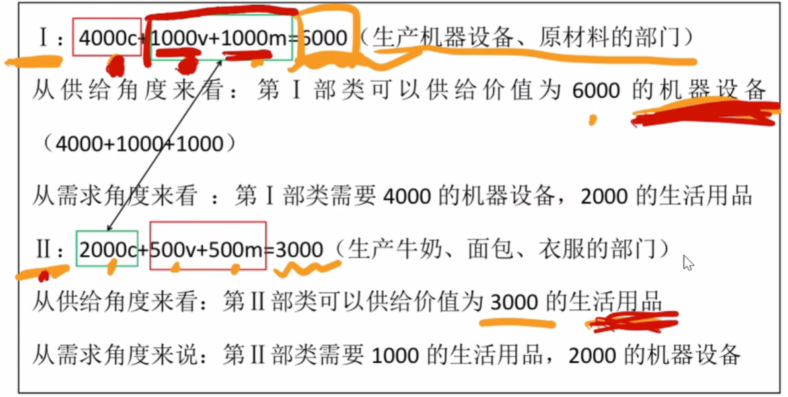

通过两个部门之间的交换，就可以互相满足对方的要求了。

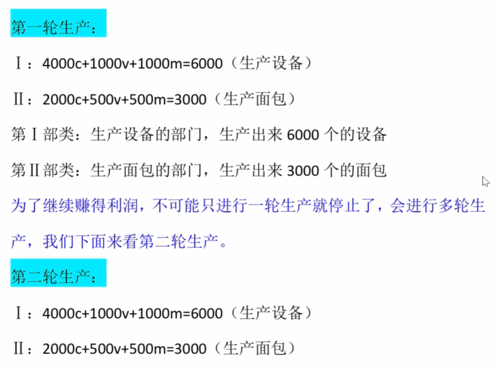

- 第一部类内部交换：就是I自己给自己的4000的机器
- 第二部类内部交换：就是II给自己的2000的机器
- 两大部类之间的交换：就是I和II互相交换来满足

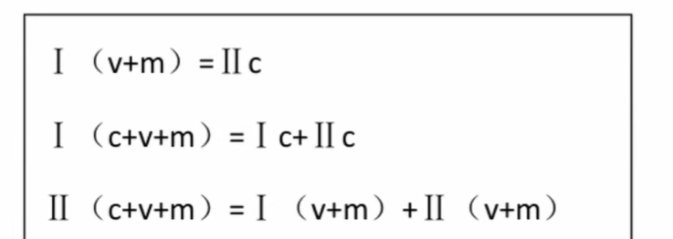

### 资本主义经济危机的实质和原因

- **资本主义经济危机的实质：**经济危机期间最根本的现象设典型特征是商品生产过剩，这是与劳动者有支付能力的需求即与劳动者的货币购买力相比的生产相对过剩。因而，资本主义经济危机实质上是生产相对过剩的危机
- **经济危机产生的根源：**根源在于资本主义生产方式的基本矛盾，即生产的社会化与生产资料私人资本主义占有形式之间的矛盾

